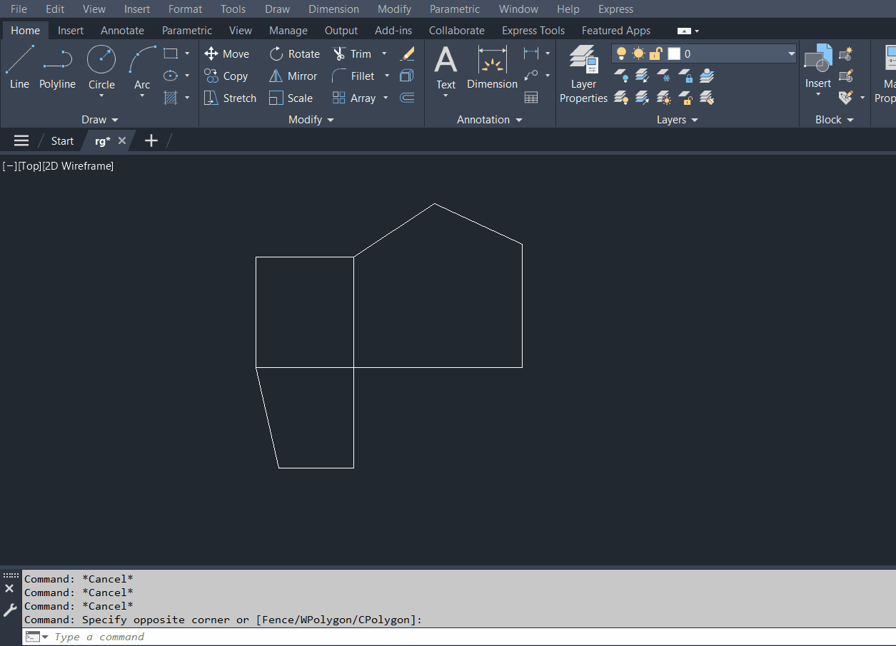

# Room Detection Graph
This project rebuilds a lightweight half-edge graph from a loose set of
2D line segments and uses it to detect all closed regions formed by the
segments. Each region is identified, its center is computed, and its area
is measured.

The core of the project focuses on graph construction and traversal:
deduplicating nodes, creating directed edges, sorting outgoing edges by
angle, linking “next” relationships, and walking cycles that represent
valid regions. 

## What it does
- Takes an unordered list of 2D segments  
- Reconstructs a graph with nodes and directed edges  
- Builds a small half-edge structure around each node  
- Traverses cycles to extract closed regions  
- Computes the centroid and area of each region  

## Why it's interesting
It’s a practical example of using graph ideas and geometric reasoning
together. It shows how a simple half-edge structure can be
used to analyze planar data in a clean and predictable way.

## Structure
- `Geometry.h`: small vector and segment utilities  
- `RoomGraph.h / .cpp`: graph construction, half-edge logic, cycle detection  

## Demo

